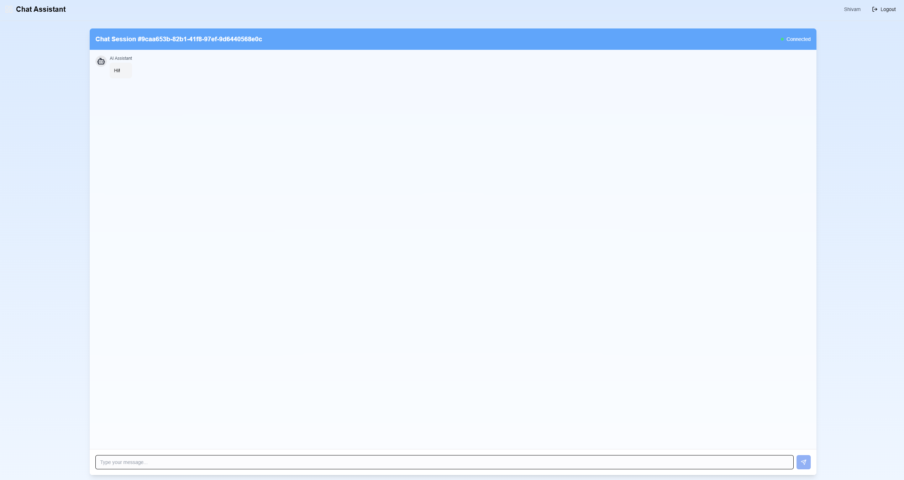
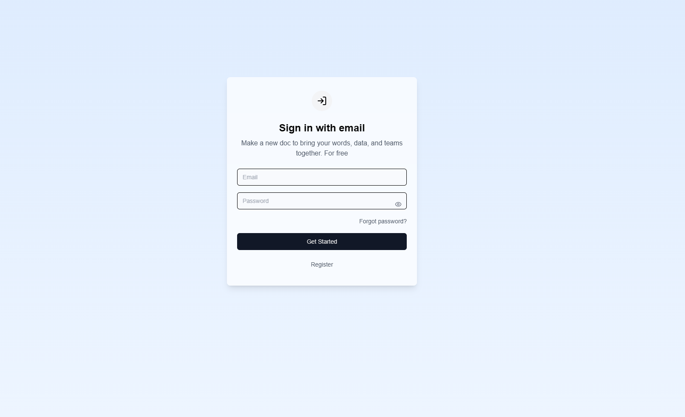

# Chat Application Frontend

A modern real-time chat application built with Next.js 13, TypeScript, and Socket.IO.

## Features

- Real-time messaging
- User authentication
- Session management
- Responsive UI with Tailwind CSS
- Secure WebSocket connections

## Tech Stack

- Next.js 13 (App Router)
- TypeScript
- Socket.IO Client
- Tailwind CSS
- Shadcn UI Components
- Axios for API calls
- React Toastify for notifications

## Getting Started

1. Clone the repository:
```bash
git clone https://github.com/kartikey-shivam/chat-app-frontend.git
```

2. Install dependencies:
npm install

3. Set up environment variables: Create a .env.local file with

NEXT_PUBLIC_API_URL=http://localhost:1337/api
NEXT_PUBLIC_SOCKET_URL=http://localhost:1337

4. Run the development server:
npm run dev

5. Open http://localhost:3000 to view the application.

```
src/
├── app/             # Next.js 13 app directory
├── components/      # Reusable UI components
├── contexts/        # React contexts
├── hooks/           # Custom React hooks
├── lib/            # Utility functions and API clients
└── types/          # TypeScript type definitions

```

## Key Components
Authentication system with JWT
Real-time chat using WebSocket
Session management
User profiles
Message history
Contributing
Fork the repository
Create your feature branch
Commit your changes
Push to the branch
Open a Pull Request

# Chat Application Frontend

A modern real-time chat application built with Next.js 13, TypeScript, and Socket.IO.






## Live Demo
# login to vercel to use deployed link
Frontend: [https://chat-app-frontend-seven-theta.vercel.app/login](https://chat-app-frontend-seven-theta.vercel.app/login)

Backend Repository: [https://github.com/kartikey-shivam/chat-app-backend](https://github.com/kartikey-shivam/chat-app-backend)


